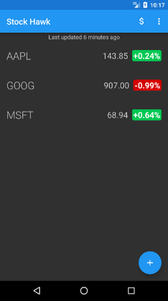
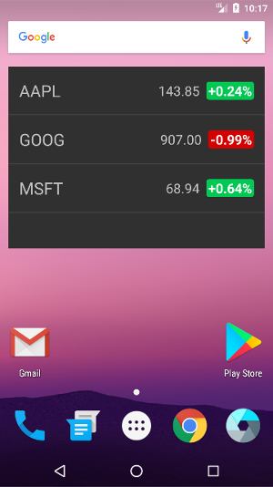

# Stock Hawk

Stock Hawk is the third app of my Udacity Android Developer Nanodegree. The app allows the user to search for stocks and add them to a list of tracked stocks. The user can also view their list of tracked stocks on the home page with the help of a collection Widget, or view more details about a given stock by clicking on that item in the list.

# Screenshots

